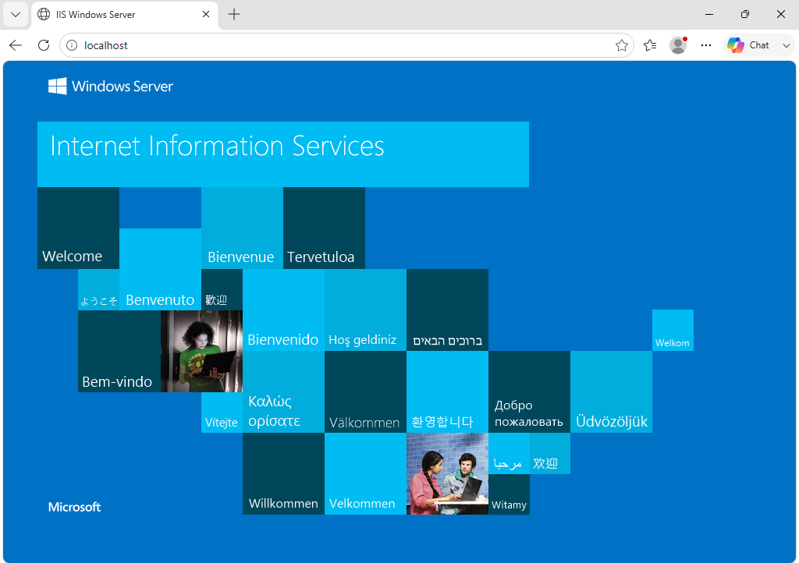

# Installing osTicket

## Objective

Deploy an internal help desk system for an X Company.

---

## Lab Environment

| Component | Value |
|-----------|------|
| Virtual Machine | Windows Server 2022 |
| Web Server | IIS |
| PHP Version | 8.x |
| Database | MySQL |
| Application | osTicket |

---

# Step 1 - Install IIS

Internet Information Services (IIS) hosts the osTicket web application.

### Procedure

1. Open **Server Manager**.
2. Select **Add Roles and Features**.
3. Choose **Role-based installation**.
4. Select the local server.
5. Enable:

- Web Server (IIS)

6. Click **Install**.

### Verification

Open a browser and navigate to:

```
http://localhost
```

The IIS default page should appear.



