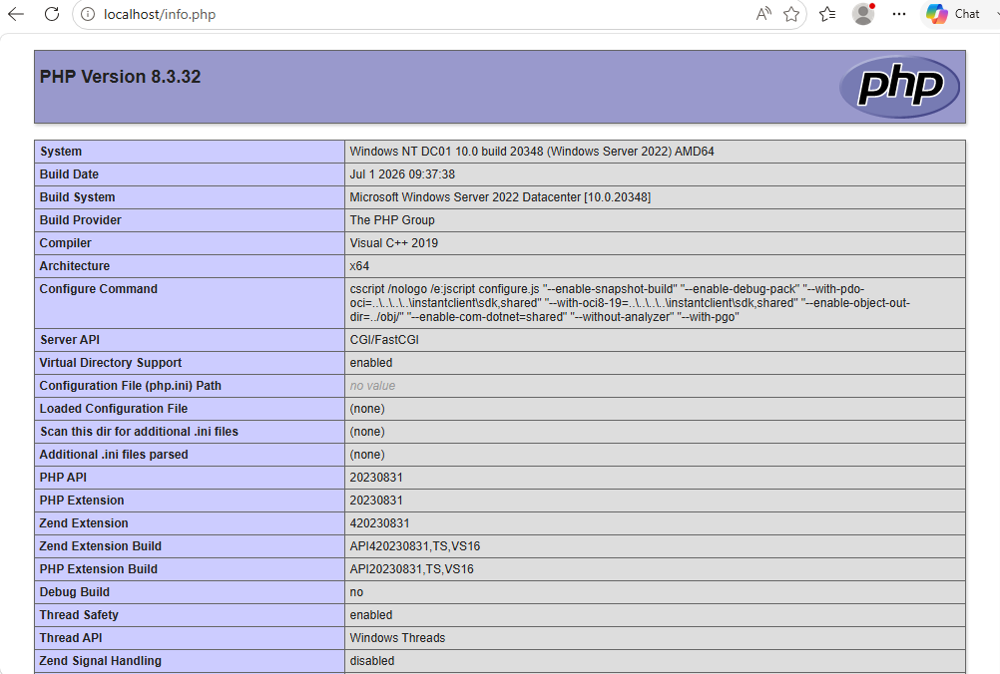
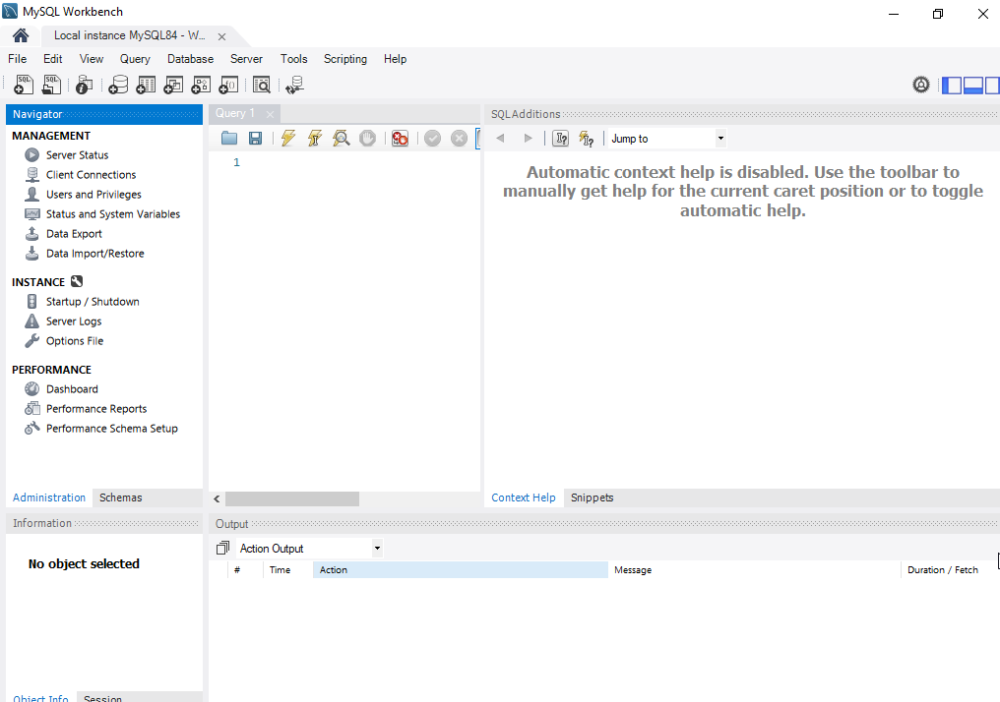
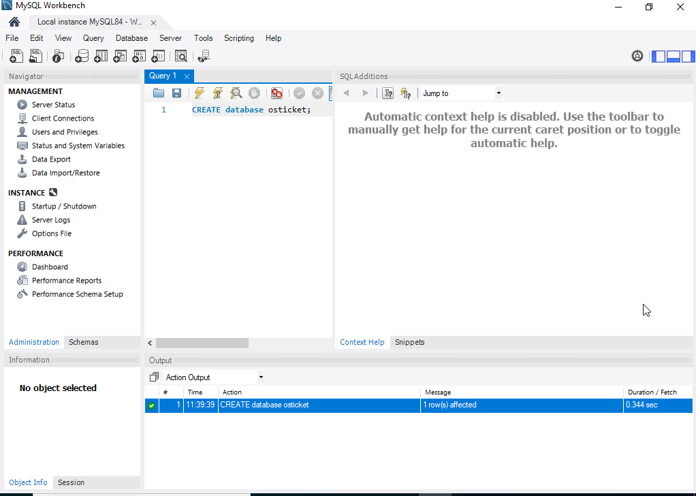
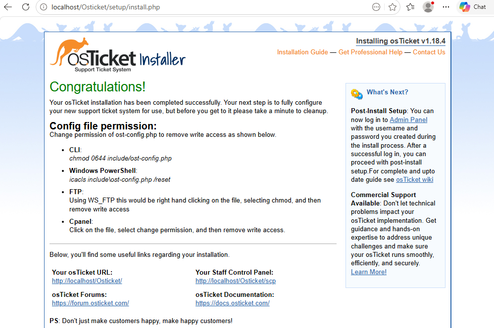
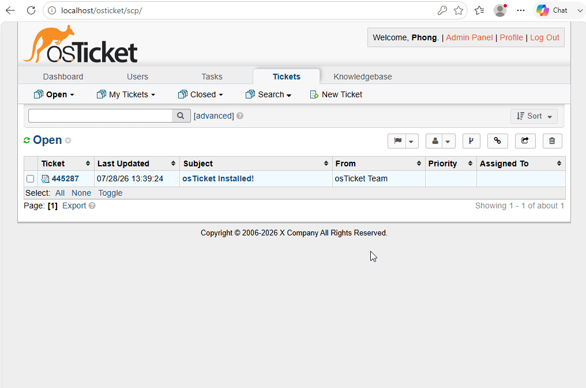

# Installing osTicket

## Objective

Deploy an internal help desk system for an X Company.

---

## Lab Environment

| Component | Value |
|-----------|------|
| Virtual Machine | Windows Server 2022 |
| Web Server | IIS |
| PHP Version | 8.3.x |
| Database | MySQL server 8.4.X and MySQL Workbench |
| Application | osTicket 1.18.4 |

---

# Step 1 - Install IIS

Internet Information Services (IIS) hosts the osTicket web application.

### Procedure

1. Open **Server Manager**.
2. Select **Add Roles and Features**.
3. Choose **Role-based installation**.
4. Select the local server.
5. Enable:

- Web Server (IIS)

6. Click **Install**.

### Verification

Open a browser and navigate to:

```
http://localhost
```

The IIS default page should appear.


---

# Step 2 - Install PHP

### Purpose

osTicket is written in PHP and requires the PHP runtime.

### Procedure

1. Download PHP.
2. Extract files to:

```
C:\PHP
```

3. Configure IIS to use PHP.

### Verification

Create:

```
info.php
```

Contents:

```php
<?php phpinfo(); ?>
```

Navigate to:

```
http://localhost/info.php
```

The PHP information page should load.



---

# Step 3 - Install MySQL

### Purpose

MySQL stores tickets, users, departments, and system settings.

### Procedure

1. Install MySQL Server.
2. Create a root password.
3. Verify the service is running.

### Verification

Log in using MySQL Workbench.



---

# Step 4 - Create Database

### Purpose

Create the database required by osTicket.

### SQL Commands

```sql
CREATE DATABASE osticket;
```

### Verification

Confirm the database exists.



---

# Step 5 - Install osTicket

### Procedure

1. Extract osTicket files into:

```
C:\inetpub\wwwroot\osTicket
```

2. Open:

```
http://localhost/osTicket
```

3. Follow the installation wizard.

Provide:

- Help Desk Name
- Administrator Account
- MySQL Server
- Database Name
- Username
- Password

Click **Install**.



---

# Step 6 - Verify Installation

Log in to the Admin Panel.

```
http://localhost/osTicket/scp
```

Verify:

- Dashboard loads
- Administrator account works
- No installation errors appear



---

# Key Takeaway 

The osTicket platform was successfully deployed using IIS, PHP, and MySQL.

- Installing and configuring **PHP manually** instead of using an automated installer.
- Configuring **FastCGI** in IIS so PHP files can be processed by the web server.
- Understanding the role of **CGI/FastCGI** and how IIS communicates with `php-cgi.exe`.
- Learning why PHP provides `php.ini-development` and `php.ini-production` templates instead of a default `php.ini`.
- Creating and configuring a `php.ini` file to enable required PHP extensions.ns
