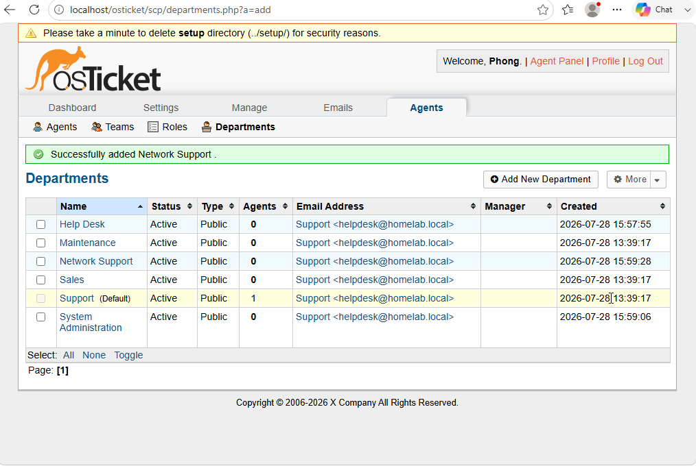
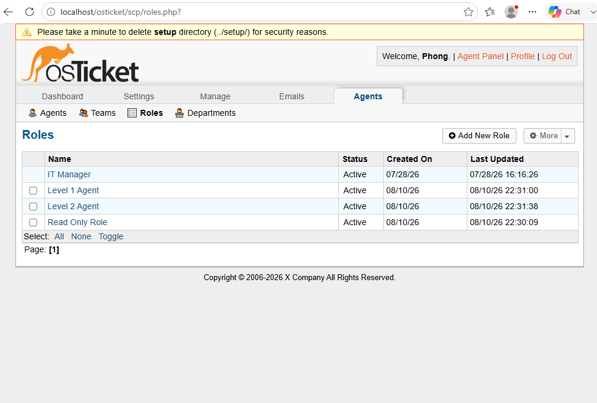
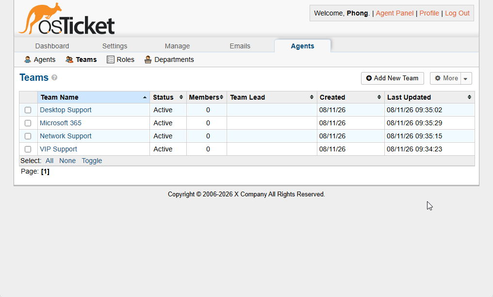
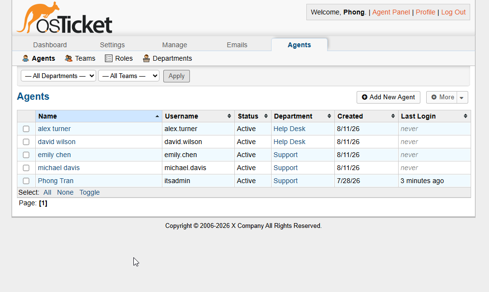

# Creating Users and Agents

## Objective 

Configure the osTicket environment by creating departments, roles, teams, support agents, and end users to prepare the help desk for daily IT operations at Contoso Manufacturing.

---

## Business Scenario 

X company has recently deployed **osTicket** to centralise IT support requests. Before employees can begin submitting tickets, the IT Administrator must configure the help desk structure, assign permissions, and create support staff accounts.

---

# Step 1 - Create Departments

### Purpose

Departments organise tickets based on the type of support required and ensure requests are routed to the correct team.

### Procedure

1. Log in to the **Admin Panel**.
2. Navigate to **Agents → Departments**.
3. Select **Add New Department**.
4. Save the configuration.

### Department Configuration

The following departments were created to categorise incoming support requests and route tickets to the appropriate business function.

| Department | Purpose |
|------------|---------|
| Help Desk | First point of contact for general IT support requests and incident logging. |
| Support | Handles escalated technical issues requiring specialised troubleshooting. |
| Finance | Processes payroll, accounting and finance-related requests. |
| Human Resources | Manages employee onboarding, offboarding and HR enquiries. |
| Facilities | Handles building maintenance, office equipment and workplace requests. |
| Sales | Supports CRM, sales software and sales-related requests. |

### Verification

Confirm all departments appear in the department list.

---

# Step 2 - Create Roles

### Purpose

Roles define the permissions available to support staff based on their responsibilities.

### Procedure

1. Navigate to **Agents → Roles**.
2. Select **Add New Role**.
3. Configure the appropriate permissions for each role.

### Role Configuration

The following roles were configured to implement role-based access control for support staff.

| Role | Responsibilities |
|------|------------------|
| IT Manager | Full administrative access to manage agents, departments, system configuration and tickets. |
| Level 1 Agent | Resolves common user issues such as password resets, software installation and printer troubleshooting. |
| Level 2 Agent | Handles advanced technical issues including Active Directory, networking and Microsoft 365 administration. |
| Read Only | Can view tickets without modifying or responding to them. Suitable for auditing and management review. |

### Verification

Verify each role appears in the Roles list with the correct permission settings.

---

# Step 3 - Create Teams

### Purpose

Teams allow multiple agents to work together and simplify ticket assignment.

### Procedure

1. Navigate to **Agents → Teams**.
2. Select **Add New Team**.
3. Create the following teams:
4. Assign agents to their respective teams.
5. Save the configuration.

## Team Configuration

Teams were created to organise support technicians by their area of expertise and improve ticket assignment.

| Team | Responsibility |
|------|----------------|
| Desktop Support | Provides support for desktops, laptops, printers and peripheral devices. |
| Microsoft 365 | Manages Exchange Online, Microsoft Teams, SharePoint, OneDrive and user licensing. |
| Network Support | Troubleshoots network connectivity, VPN, switches, routers and wireless infrastructure. |
| VIP Support | Provides priority technical assistance for executives and high-priority users. |

### Verification

Confirm both teams are listed and contain the correct members.

---

# Step 4 - Create Support Agents

### Purpose

Create technician accounts responsible for resolving support requests.

### Procedure

1. Navigate to **Agents → Add New Agent**.
2. Enter the agent information.
3. Save the account.

### Agent Configuration

| Agent | Department | Team | Role |
|--------|------------|------|------|
| Alex Turner | Help Desk | Desktop Support | Level 1 Agent |
| Emily Chen | Support | Microsoft 365 | Level 2 Agent |
| Michael Davis | Support | Network Support | Level 2 Agent |
| David Wilson | Help Desk | VIP Support | IT Manager |

### Verification

Confirm each support agent appears in the Agent Directory.

---

# Step 5 - Create End Users

### Purpose

Create employee accounts that can submit support requests through the customer portal.

### Procedure

1. Navigate to **Users → User Directory**.
2. Select **Add User**.
3. Enter the employee details.
4. Save the account.

